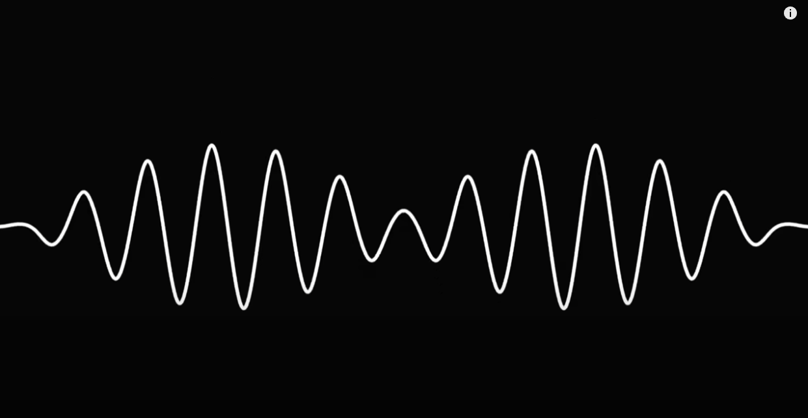

# Creative Coding Major Assignment

## Instructions

Run the Live Server and open up the artwork.
Use the arrow music to play 4 different type of music sourced from <https://pmmusic.pro/>.

The 4 songs and the associated arrow keys are:
|Arrow key|Song - Artist|
|---------|-------------|
|LEFT|Cello Suite No.1 - Bach|
|RIGHT|Ride of the Valkyries - Wagner|
|DOWN|Romeo and Juliet Love Theme - Tchaikovsky|
|UP|Russian Dance Nutcracker Suite - Tchaikovsky |

Pressing the enter button would stop the song.

## Chosen animation

The chosen animation for the individual section is audio which uses the level or frequency to animate the work.

## Animated Properties

- The velocity of the wave triangles changes depending on the treble of the music.
- The size of the wave changes depending on the bass of the music.
- The building changes colour depending on the middle frequency and choice of the song.
- The water wave changes on the ftt spectrum.
- The frameRate also increases on the treble of the song.
- The seagulls move across the screen according to the ftt spectrum.

## Inspirations

The last step in the week 11 tutorial inspired me to implement the size alteration in the artwork. The difference is that I wanted to use a different element so I looked into different ways to implementing other parts of the song.

Whenever I think of Claude Monet's artworks, classical music comes into mind. So for the artwork, I've implemented classical music. I wanted to have a range of music so I've selected a couple of different songs and use some basic colour to convey the tone. This is why the building changed colour.

The wave-like implementation of the piece was inspired by the artwork cover of the song "Do I Wanna Know" by the Arctic Monkey

While writing the code, I kept thinking which part of the code I could also change without comprising the whole artwork which lead to the movement of the seagull and the frameRate changes.
After seeing it run properly I greatly enjoyed the outcome of the individual code.

## Technical explaination

To implement the code, I utilised a lot of week 11 tutorial content and also additionally used the documentation found on p5.js website.

Firstly make an array for soundfiles and push all the soundfiles into it.
``
  soundfiles.push(loadSound('assets/PMM-Bach-Cello-Suite-No.-1-G-Major-MASTER_V1.wav'));
  soundfiles.push(loadSound('assets/PMM-Ride-of-The-Valkyries-MASTER-V1.wav'));
  soundfiles.push(loadSound('assets/PMM-Russian-Dance-Tchaikovsky-MASTER-V1.wav'));
  soundfiles.push(loadSound('assets/PMM-Romeo-and-Julliet-MASTER-V1.wav'));
``

For the key pressed function, a for loop statement is used to detect if any of the songs is playing and close it before playing the new song. The p5.js Keypressed function and simple if else statements to detect the KeyCode that was pressed. Then I used a variable to keep track what the song is playing.
``
function keyPressed(){
  for(let song of soundfiles){
    console.log(song)
    if(song.isPlaying()){
      song.stop();
    }
  }
  if(keyCode !== ENTER){
    if (keyCode === LEFT_ARROW) {
      this.songValue = 0;
    } else if (keyCode === RIGHT_ARROW) {
      this.songValue = 1;
    }
    else if (keyCode === UP_ARROW) {
      this.songValue = 2;
    }
    else if (keyCode === DOWN_ARROW) {
      this.songValue = 3;
    }
    analyzer.setInput(soundfiles[this.songValue]);
    soundfiles[this.songValue].connect(fft);
    soundfiles[this.songValue].loop();
  }
``

<https://p5js.org/reference/#/p5.FFT>
I quickly found I could use the different frequenccy fo find the bass, treble and mid.
``
  let spectrum = fft.analyze();
  let treble = fft.getEnergy("treble");
  let bass = fft.getEnergy("bass");
  let mid = fft.getEnergy("mid");
``

Whilst implementing the group code, I made sure leave in the constructor variables that I would like to change in the artwork so that I did not have to rewrite a majority of the code. Additionally writing any additional methods that would get me for example the updateColours in the building.
``
  // this methods updates the colours of the building
  updateColours(red, green, blue) {
    this.red = red;
    this.green = green;
    this.blue = blue;
  }
``

Most of the techniques and coding used in the individual code either comes from the tutorials or my own experience of coding for years.
